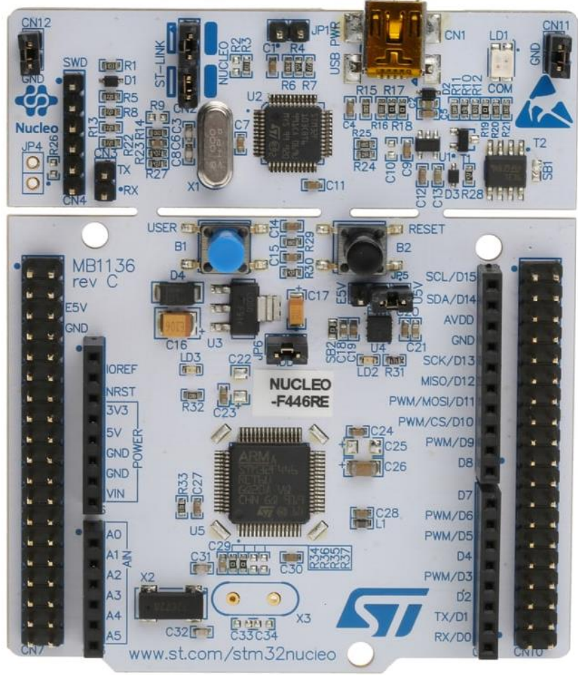

# STM32 playground
The repository contains some basic STM32 projects using my own library.

## Examples
* [Example 1 - Led Blink](./examples/led_blink/README.md)
* [Example 2 - Led Control by Button](./examples/led_control_by_button/README.md)
* [Example 3 - Led Control by Button with Interrupt](./examples/led_control_by_button_with_interrupt/README.md)
* Example 4 - Clock Tree
* Example 5 - UART Transmitter
* Example 6 - UART Receiver
* Example 7 - UART Loopback Test

## IDE
* VSCode
* PlatformIO

## Board: NUCLEO-F446RE (STM32F446RE)
* [Datasheet](./datasheet/stm32f446re.pdf)
* [Reference Manual (RM0390)](./datasheet/RM0390_reference_manual.pdf)
* [User Manual (UM1724)](./datasheet/UM1724_user_manual.pdf)

    

