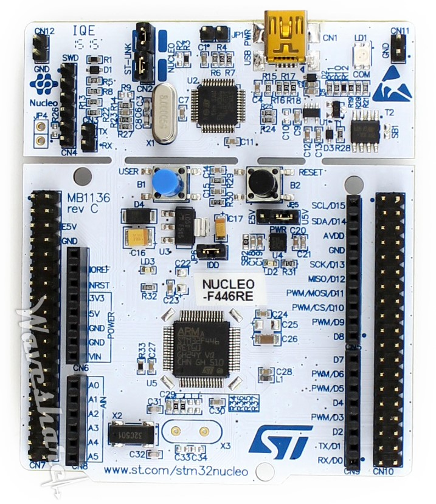

# STM32 playground
The repository contains some basic STM32 projects using the libopencm3 library. 

[Libopencm3](https://github.com/libopencm3/libopencm3) is open source ARM Cortex-M microcontroller library.

## Examples
* [Led Blink](./examples/led_blink/src/main.c)

## IDE
* VSCode
* PlatformIO

## Board: NUCLEO-F446RE (STM32F446RE)
* [Datasheet](./datasheet/stm32f446re.pdf)

