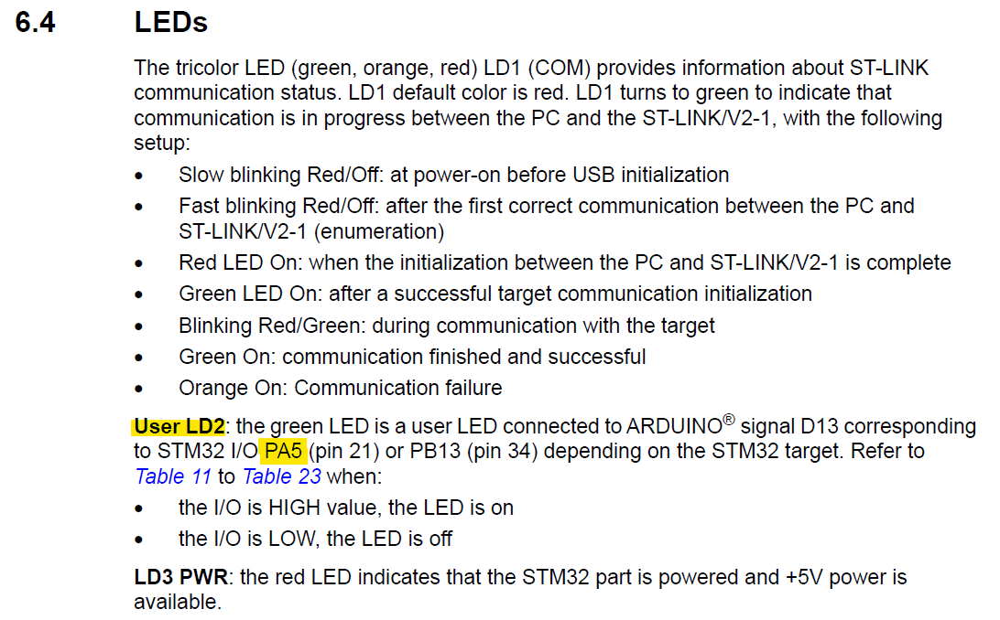
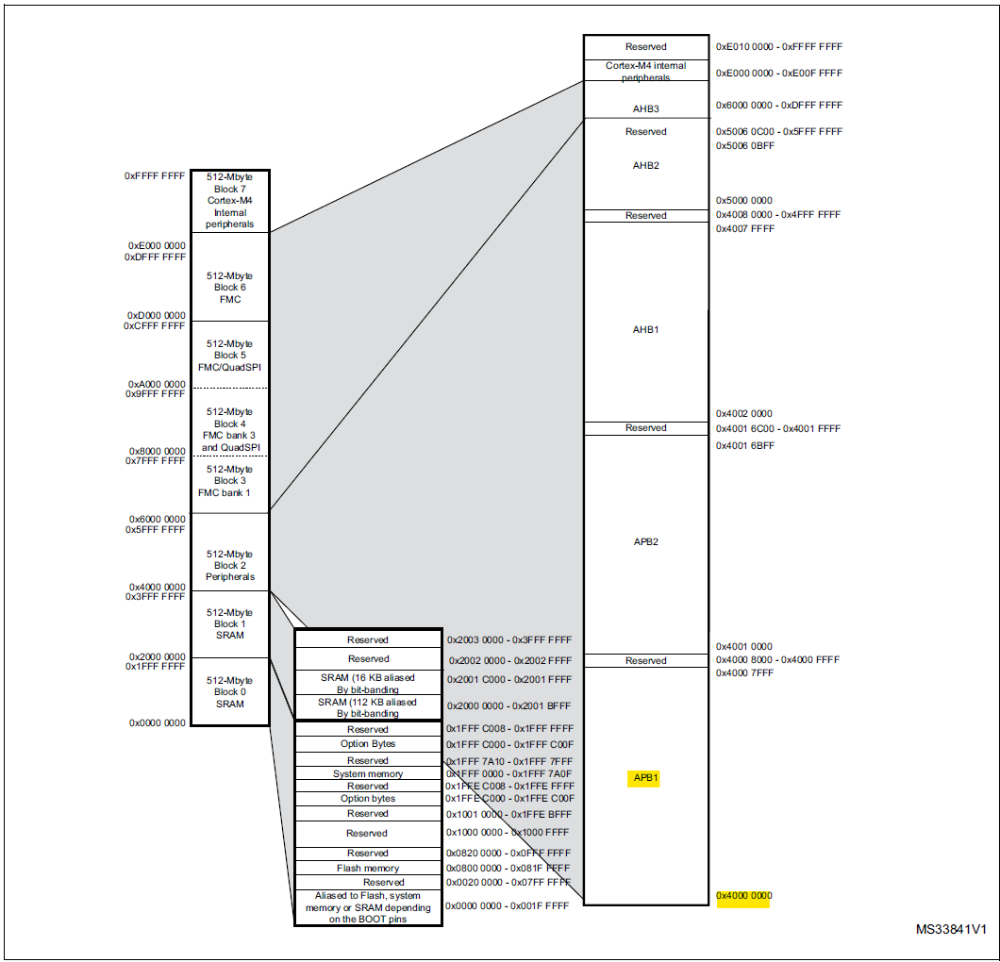
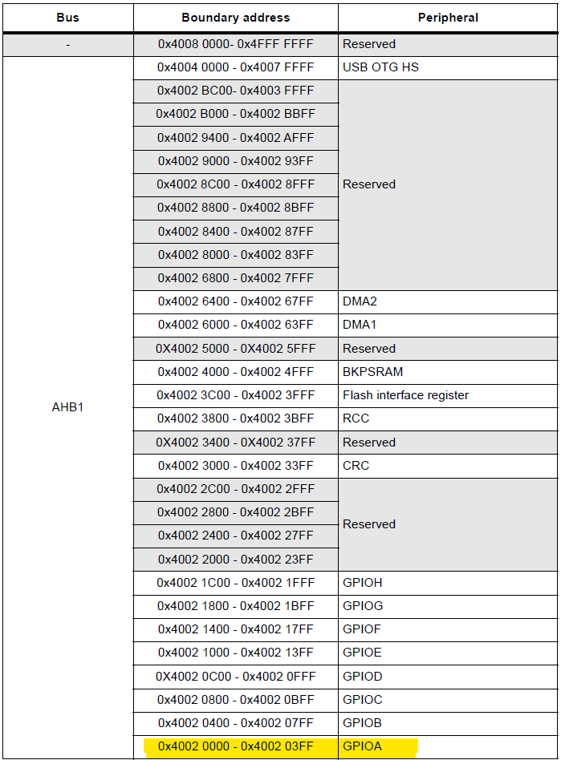
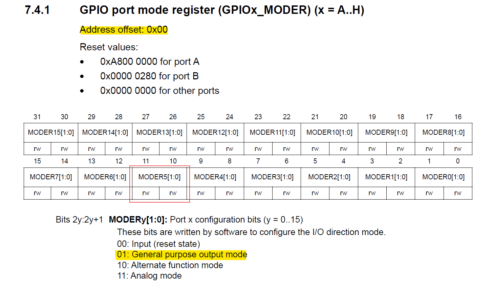
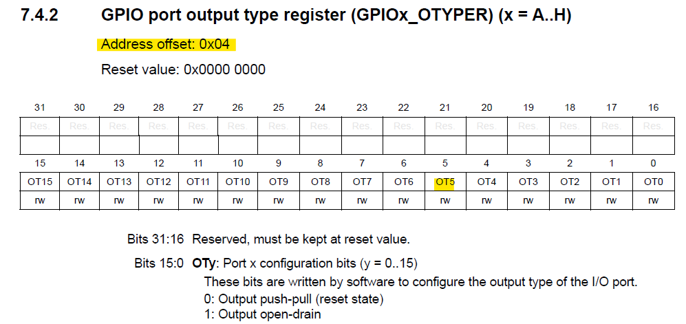
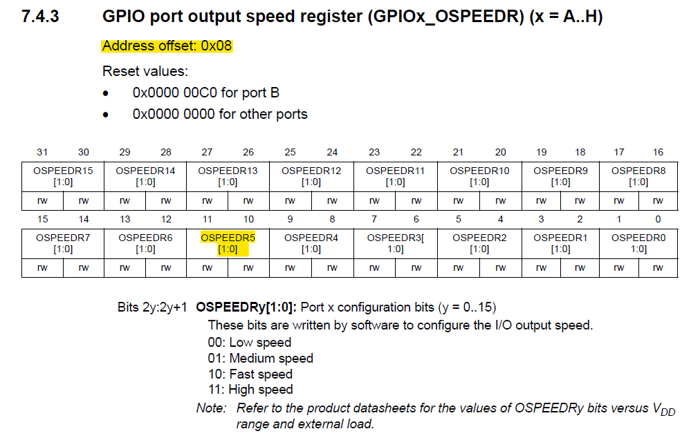
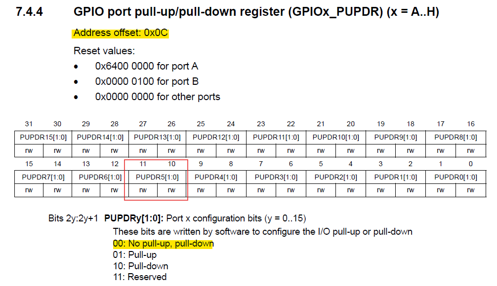
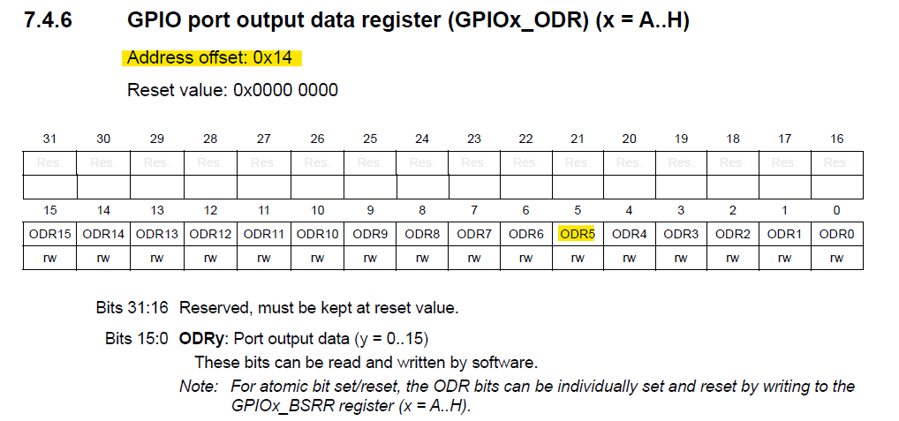
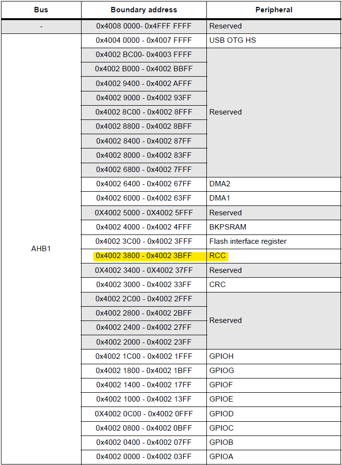
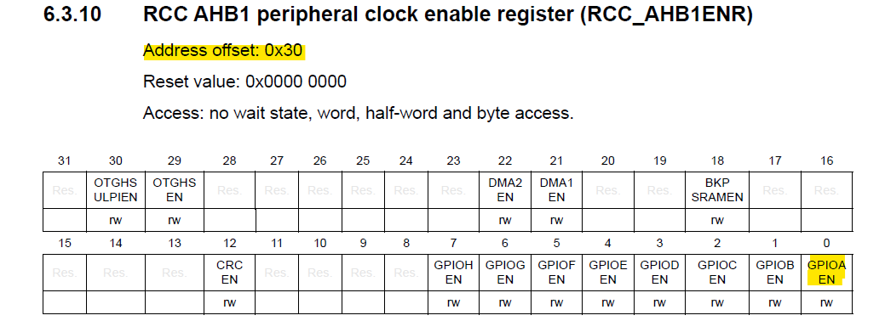

## Led Blink
This example toggles Led2 on the STM32 board blink every second

### LED
Because we want to blink LED2, we can find from the Reference Manual (UM1724) that LED2 corresponds to PA5 (Port A, Pin 5).



```c
#if defined(NUCLEO_F446RE)
  #define RCC_LED_GPIO  (RCC_GPIOA)   // Reset and Clock Control (RCC) port
  #define GPIO_LED_PORT (GPIOA)       // General Purpose Input Output (GPIO) port
  #define PIN5          (5)           // General Purpose Input Output (GPIO) pin
#else
  #error "Your STM32 board is not NUCLEO-F446RE!"
#endif
```

### Memory Map
First, locate the base address of AHB1 in the memory map.

```c
#define GET_ADDR(x) (x)

#define PERIPHERAL_BASE         (0x40000000)
#define AHB1_OFFSET             (0x00020000)
#define PERIPHERAL_AHB1_BASE    GET_ADDR(PERIPHERAL_BASE + AHB1_OFFSET)
```



## General-purpose Input/Output (GPIO)
### GPIOA Address
Next, find the address of GPIOA in AHB1.

```c
#define GPIOA_OFFSET    (0x00000000)
#define GPIOA           GET_ADDR(PERIPHERAL_AHB1_BASE + GPIOA_OFFSET)
```



### GPIO Register - MODER
Initialize MODER of GPIOA, then set MODER5 (pin5) to General purpose output mode.


```c
// GPIOx_MODER (0x00)
#define GPIO_MODER_OFFSET           0x00
#define INPUT_RESET_STATE           0x00
#define GENERAL_PURPOSE_OUTPUT_MODE 0x01
#define ALTERNATE_FUNCTION_MODE     0x10
#define ANALOG_MODE                 0x11

#define CLEAR_MODER(pin)                    (~((0x11) << (2 * (pin))))
#define CLEAR_GPIOX_MODER(gpiox, pin)       WRITE_REG_LWORD(gpiox, GPIO_MODER_OFFSET, READ_REG_LWORD(gpiox, GPIO_MODER_OFFSET) & CLEAR_MODER(pin))
#define SET_MODER(pin, moder)               ((moder) << (2 * (pin)))
#define SET_GPIOX_MODER(gpiox, pin, moder)  WRITE_REG_LWORD(gpiox, GPIO_MODER_OFFSET, READ_REG_LWORD(gpiox, GPIO_MODER_OFFSET) | SET_MODER(pin, moder))

CLEAR_GPIOX_MODER(GPIO_LED_PORT, PIN5);
SET_GPIOX_MODER(GPIO_LED_PORT, PIN5, GENERAL_PURPOSE_OUTPUT_MODE);
```

### GPIO Register - OTYPER
Set OTYPER5 (pin5) to output push-pull.



```c
#define GPIO_OTYPER_OFFSET          0x04
#define OUTPUT_PUSH_PULL            0x0
#define OUTPUT_OPEN_DRAIN           0x1

#define SET_GPIOX_OTYPER_PP(gpiox, pin)     WRITE_REG_LWORD(GPIOA, GPIO_OTYPER_OFFSET, READ_REG_LWORD(gpiox, GPIO_OTYPER_OFFSET) & (~(OUTPUT_PUSH_PULL << (pin))))

SET_GPIOX_OTYPER_PP(GPIO_LED_PORT, PIN5);
```

### GPIO Register - OSPEED
Initialize OSPEED of GPIOA, then set OSPEED5 (pin5) to low speed (2MHz).



```c
#define GPIO_OSPEEDR_OFFSET         0x08
#define LOW_SPEED_2MHZ              0x00
#define MEDIUM_SPEED_25MHZ          0x01
#define FAST_SPEED_50MHZ            0x10
#define HIGH_SPEED_100MHZ           0x11

#define CLEAR_OSPEEDR(pin)                      (~((0x11) << (2 * (pin))))
#define CLEAR_GPIOX_OSPEEDR(gpiox, pin)         WRITE_REG_LWORD(gpiox, GPIO_OSPEEDR_OFFSET, READ_REG_LWORD(gpiox, GPIO_OSPEEDR_OFFSET) & CLEAR_OSPEEDR(pin))
#define SET_OSPEEDR(pin, speed)                 ((speed) << (2 * (pin)))
#define SET_GPIOX_OSPEEDR(gpiox, pin, speed)    WRITE_REG_LWORD(gpiox, GPIO_OSPEEDR_OFFSET, READ_REG_LWORD(gpiox, GPIO_OSPEEDR_OFFSET) | SET_OSPEEDR(pin, speed))
#define GET_OSPEEDR(gpiox, pin)                 ((READ_REG_LWORD(gpiox, GPIO_OSPEEDR_OFFSET) >> (2 * (pin))) & 0x11)

CLEAR_GPIOX_OSPEEDR(GPIO_LED_PORT, PIN5);
SET_GPIOX_OSPEEDR(GPIO_LED_PORT, PIN5, LOW_SPEED_2MHZ);
```

### GPIO Register - PUDER
Initialize PUDER of GPIOA, then set PUDER5 (pin5) to No pull-up, pull down.



```c
// GPIOx_PUPDR (0x0C)
#define GPIO_PUPDR_OFFSET           0x0C
#define NO_PULL_UP_PULL_DOWN        0x00
#define PULL_UP                     0x01
#define PULL_DOWN                   0x10
#define PUPDR_RESERVED              0x11

#define CLEAR_PUPDR(pin)                    (~((0x11) << (2 * (pin))))
#define CLEAR_GPIOX_PUPDR(gpiox, pin)       WRITE_REG_LWORD(gpiox, GPIO_PUPDR_OFFSET, READ_REG_LWORD(gpiox, GPIO_PUPDR_OFFSET) & CLEAR_PUPDR(pin))
#define SET_PUPDR(pin, pupdr)               ((pupdr) << (2 * (pin)))
#define SET_GPIOX_PUPDR(gpiox, pin, pupdr)  WRITE_REG_LWORD(gpiox, GPIO_PUPDR_OFFSET, READ_REG_LWORD(gpiox, GPIO_PUPDR_OFFSET) | SET_PUPDR(pin, pupdr))

CLEAR_GPIOX_PUPDR(GPIO_LED_PORT, PIN5);
SET_GPIOX_PUPDR(GPIO_LED_PORT, PIN5, NO_PULL_UP_PULL_DOWN);
```

### GPIO Register - GPIOx_ODR
To toggle the LED, it is necessary to read the value of this register and perform an XOR operation.



```c
#define GPIO_ODR_OFFSET           0x14

#define TOGGLE_GPIOX(gpiox, pin)            WRITE_REG_LWORD(gpiox, GPIO_ODR_OFFSET, READ_REG_LWORD(gpiox, GPIO_ODR_OFFSET) ^ (0x1 << (pin)))
```

## Reset and Clock Control (RCC)
### RCC Address
Find the address of RCC in AHB1.

```c
#define RCC_OFFSET      (0x00003800)
#define RCC             GET_ADDR(PERIPHERAL_AHB1_BASE + RCC_OFFSET)
```



### RCC Register - RCC_AHB1ENR
Enable RCC GPIOA.



```c
#define RCC_GPIOX_ENABLE(gpiox)     WRITE_REG_LWORD(RCC, RCC_AHB1ENR_OFFSET, READ_REG_LWORD(RCC, RCC_AHB1ENR_OFFSET) | (GPIOX_ENABLE << RCC_GPIOX_TABLE[gpiox]))
#define RCC_GPIOX_DISABLE(gpiox)    WRITE_REG_LWORD(RCC, RCC_AHB1ENR_OFFSET, READ_REG_LWORD(RCC, RCC_AHB1ENR_OFFSET) & (~(GPIOX_ENABLE << RCC_GPIOX_TABLE[gpiox])))

RCC_GPIOX_ENABLE(RCC_LED_GPIO);
```

## Time Delay Function
Adjust the delay time according to the value set in GPIOx_OSPEEDR.

|GPIOx_OSPEEDR|Definition|Frequency|
|-|-|-|
|00|Low speed|2MHz|
|01|Medium speed|25MHz|
|10|Fast speed|50MHz|
|11|High speed|100MHz|

```c
BYTE timer_delay(LWORD u32_time_ms, BYTE u08_ospeedr)
{
    LWORD u32_delay_time_us = 0;
    switch(u08_ospeedr)
    {
        case LOW_SPEED_2MHZ:
            u32_delay_time_us = u32_time_ms * 2000000 / 1000;
            break;
        case MEDIUM_SPEED_25MHZ:
            u32_delay_time_us = u32_time_ms * 25000000 / 1000;
            break;
        case FAST_SPEED_50MHZ:
            u32_delay_time_us = u32_time_ms * 50000000 / 1000;
            break;
        case HIGH_SPEED_100MHZ:
            u32_delay_time_us = u32_time_ms * 100000000 / 1000;
            break;
        default:
            return FUNC_FAIL;
    }

    for(LWORD u32i = 0; u32i < u32_delay_time_us; u32i++)
    {
        __asm__("nop");
    }

    return FUNC_SUCCESS;
}

u08Ret |= timer_delay(1000, GET_OSPEEDR(GPIO_LED_PORT, PIN5));
```