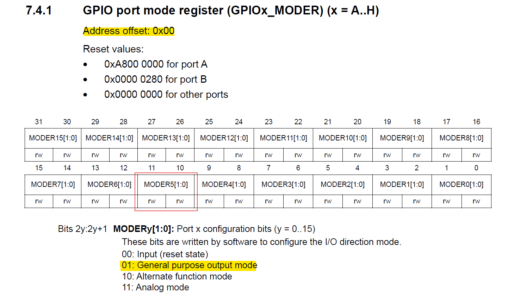

## Led blink
This example toggles GPIOA to make the LED on the STM32 board blink every second

### Memory Map
First, locate the base address of AHB1 in the memory map.

```c
#define GET_ADDR(x) (x)

#define PERIPHERAL_BASE         (0x40000000)
#define AHB1_OFFSET             (0x00020000)
#define PERIPHERAL_AHB1_BASE    GET_ADDR(PERIPHERAL_BASE + AHB1_OFFSET)
```


### GPIOA Address
Next, find the address of GPIOA in AHB1.

```c
#define GPIOA_OFFSET    (0x00000000)
#define GPIOA           GET_ADDR(PERIPHERAL_AHB1_BASE + GPIOA_OFFSET)
```


### GPIOA Register


