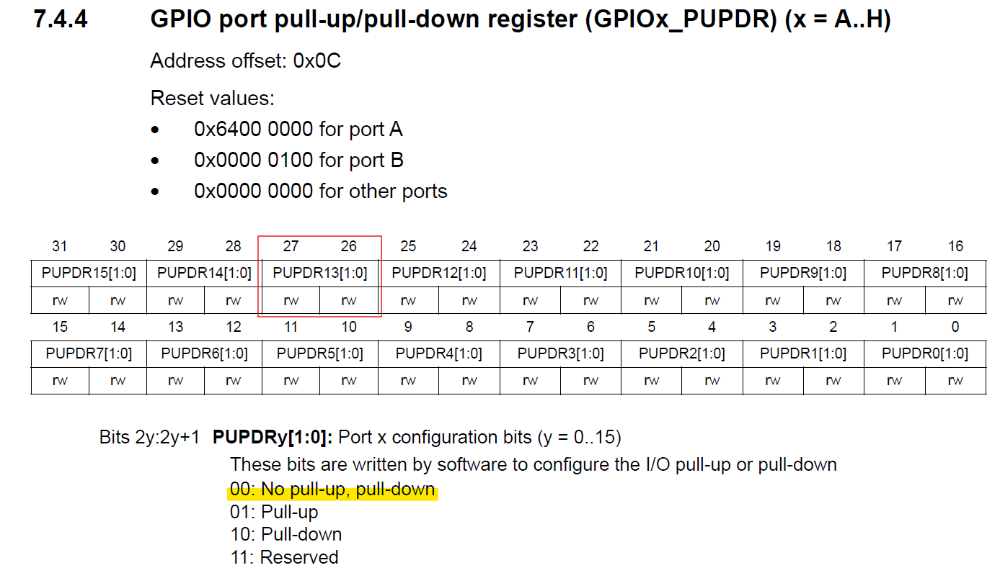

## Led Control by Button
Control Led2 by pressing button on STM32

### Push-button
Find from the Reference Manual (UM1724) that button corresponds to PC13 (Port C, Pin 13).


```c
#define RCC_BUTTON_GPIO   (RCC_GPIOC)   
#define GPIO_BUTTON_PORT  (GPIOC)
#define PIN13             (13)
```

When the button (B1 USER) is pressed, the PC13 will get low voltage.


## GPIOA Configuration
Same as [Example 1 - Led Blink](../led_blink/README.md)

## GPIOC Configuration
### GPIOC Address
Find the address of GPIOC in AHB1.

```c
#define GPIOC_OFFSET    (0x00000800)
#define GPIOC           GET_ADDR(PERIPHERAL_AHB1_BASE + GPIOC_OFFSET)
```


### GPIO Register - MODER
Initialize MODER of GPIOC, then set MODER13 (pin13) to Input (reset mode).


```c
CLEAR_GPIOX_MODER(GPIO_BUTTON_PORT, PIN13);
SET_GPIOX_MODER(GPIO_BUTTON_PORT, PIN13, INPUT_RESET_STATE);
```

### GPIO Register - PUDER
Initialize PUDER of GPIOC, then set PUDER13 (pin13) to No pull-up, pull down.



```c
CLEAR_GPIOX_PUPDR(GPIO_BUTTON_PORT, PIN13);
SET_GPIOX_PUPDR(GPIO_BUTTON_PORT, PIN13, NO_PULL_UP_PULL_DOWN);
```

### GPIO Register - IDR
Read GPIOx_IDR to detect whether the button is pressed.


```c
#define GPIO_IDR_OFFSET             0x10
#define GET_GPIOX_IDR(gpiox, pin)           ((READ_REG_LWORD(gpiox, GPIO_IDR_OFFSET)) & (0x1 << (pin)))

BYTE u08_is_pressed = (GET_GPIOX_IDR(GPIO_BUTTON_PORT, PIN13) == PRESSED);
if(u08_is_pressed)
    SET_GPIOX(GPIO_LED_PORT, PIN5);
else
    CLEAR_GPIOX(GPIO_LED_PORT, PIN5);
```

## Reset and Clock Control (RCC)
### RCC Register - RCC_AHB1ENR
Enable RCC GPIOC.


```c
RCC_GPIOX_ENABLE(RCC_BUTTON_GPIO);
```