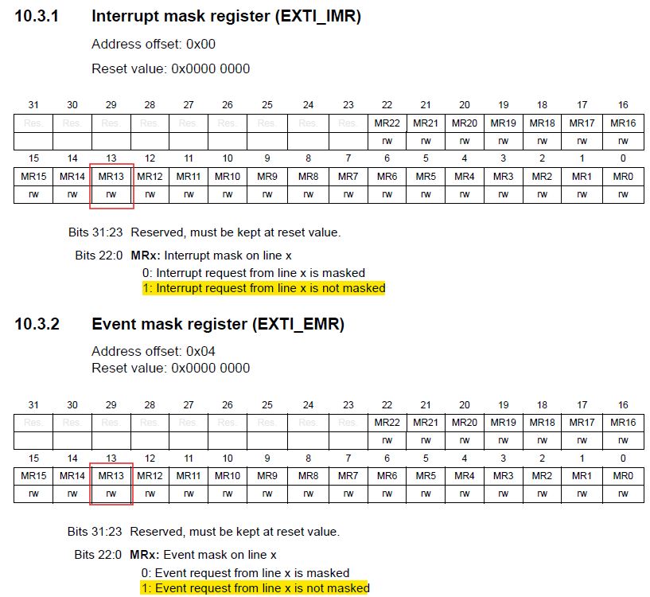

## Led Control by Button with Interrupt
This example uses an external interrupt (button press) to change the LED toggle timing.

## GPIOA Configuration
Same as [Example 1 - Led Blink](../led_blink/README.md)

## GPIOC Configuration
Same as [Example 2 - Led Control by Button](../led_control_by_button/README.md)

## Reset and Clock Control (RCC)
Enable RCC SYSCFG to make External Interrupt (EXTI) working.


```c
#define RCC_APB2_ENABLE(clken)     WRITE_REG_LWORD(RCC, RCC_APB2ENR_OFFSET, READ_REG_LWORD(RCC, RCC_APB2ENR_OFFSET) | (CLK_ENABLE << RCC_APB2_TABLE[clken]))
#define RCC_APB2_DISABLE(clken)    WRITE_REG_LWORD(RCC, RCC_APB2ENR_OFFSET, READ_REG_LWORD(RCC, RCC_APB2ENR_OFFSET) & (~(CLK_ENABLE << RCC_APB2_TABLE[clken])))

RCC_APB2_ENABLE(RCC_SYSCFG_PORT);
```

## External Interrupt (EXTI) Configuration
### External Interrupt/Event GPIO mapping
Since there aren't many EXTI lines, several GPIO ports share the same EXTI.

In this example, we use the button (PC13) for the external interrupt, so EXTI13 is utilized.


### SYSCFG Configuration for EXTI13
Find the address of SYSCFG in APB2.


```c
#define SYSCFG_OFFSET    (0x00003800)
#define SYSCFG           GET_ADDR(PERIPHERAL_APB2_BASE + SYSCFG_OFFSET)
```

### RCC Register - RCC_APB2ENR
And then enable RCC SYSCFG.


```c
#define RCC_APB2_ENABLE(clken)     WRITE_REG_LWORD(RCC, RCC_APB2ENR_OFFSET, READ_REG_LWORD(RCC, RCC_APB2ENR_OFFSET) | (CLK_ENABLE << RCC_APB2_TABLE[clken]))

// RCC enable
RCC_APB2_ENABLE(RCC_SYSCFG_PORT);
```

### SYSCFG EXTI Setup
Because we use the button (PC13) for the external interrupt, we need to write 0010 at EXTI13 for PC13.


```c
#define CLEAR_SYSCFG_EXTICR4_EXTIx(EXTIx)           WRITE_SYSCFG_EXTICR4(READ_SYSCFG_EXTICR4() & (~(0xF << ((EXTIx % 4) * 4))))
#define SET_SYSCFG_EXTICR4_EXTIx(EXTIx, EXTI_GPIOx) WRITE_SYSCFG_EXTICR4(READ_SYSCFG_EXTICR4() | (EXTI_GPIOX_TABLE[EXTI_GPIOx] << ((EXTIx % 4) * 4)))

// SYSCFG EXTI
CLEAR_SYSCFG_EXTICR4_EXTIx(PIN13);
SET_SYSCFG_EXTICR4_EXTIx(PIN13, EXTI_BUTTON_PORT);
```

## Nested Vectored Interrupt Controller (NVIC)

In the Reference Manual, we can find the EXTI13 interrupt request (IRQ) at Position 40 through the NVIC table. To enable this IRQ, we need to first configure the NVIC_ISERx.


### NVIC address
The NVIC registers are located in the Cortex M4 Internal Peripherals, so we need to refer to the Cortex-M4 Devices Generic User Guide.


```c
// Cortex M4 Internal Peripherals
#define CORTEX_M4_INTERNAL_PERIPHERALS  (0xE0000000)

// NVIC
#define NVIC_OFFSET                     (0x0000E100)
#define NVIC_BASE                       GET_ADDR(CORTEX_M4_INTERNAL_PERIPHERALS + NVIC_OFFSET)
```

### NVIC_ISERx Register
There are 8 NVIC_ISER (0 ~ 7) registers, each with 32 bits. Since we want to enable NVIC_EXTI15_10 (Position 40), we need to set the 8th bit of NVIC_ISER1 to 1.


```c
// Interrupt Set-enable Registers
#define NVIC_ISER_OFFSET     (0x00000000)
#define NVIC_ISER            GET_ADDR(NVIC_BASE + NVIC_ISER_OFFSET)

// NVIC_ISER0
#define NVIC_ISER0_OFFSET          0x00

#define READ_NVIC_ISERx(ISERx)                READ_REG_LWORD(NVIC_ISER, NVIC_ISER0_OFFSET + (ISERx)*4)
#define WRITE_NVIC_ISERx(ISERx, u32Value)     WRITE_REG_LWORD(NVIC_ISER, NVIC_ISER0_OFFSET + (ISERx)*4, READ_NVIC_ISERx(ISERx) | (u32Value))

#define SET_INTERRUPT_ENABLE(interrupt)       WRITE_NVIC_ISERx(NVIC_TABLE[interrupt] / 32, 1 << (NVIC_TABLE[interrupt] % 32))    

// NVIC trigger sourse
SET_INTERRUPT_ENABLE(NVIC_BUTTON_IRQ);
```

### EXTI_RTSR and EXTI_FTSR
After enabling this NVIC IRQ, the next step is to select the trigger type. Since the user button is pressed low, the trigger should be set to falling mode. To set PIN13 to falling mode, we need to disable EXTI_RTSR and enable EXTI_FTSR.


```c
// EXTI_RTSR (0x08)
#define EXTI_RTSR_OFFSET            0x08
#define READ_EXTI_RTSR()            READ_REG_LWORD(EXTI, EXTI_RTSR_OFFSET)
#define WRITE_EXTI_RTSR(u32Value)   WRITE_REG_LWORD(EXTI, EXTI_RTSR_OFFSET, u32Value)

// EXTI_FTSR (0x0C)
#define EXTI_FTSR_OFFSET            0x0C
#define READ_EXTI_FTSR()            READ_REG_LWORD(EXTI, EXTI_FTSR_OFFSET)
#define WRITE_EXTI_FTSR(u32Value)   WRITE_REG_LWORD(EXTI, EXTI_FTSR_OFFSET, u32Value)

// Set Trigger Type to Falling moode
#define SET_EXTI_FALLING_MODE(line) {                        \
    WRITE_EXTI_RTSR(READ_EXTI_RTSR() & (~(1 << line)));      \
    WRITE_EXTI_FTSR(READ_EXTI_FTSR() | (1 << (line)));       \
}

// EXTI trigger type
SET_EXTI_FALLING_MODE(PIN13);
```

### EXTI_IMR and EXTI_EMR
Next, we need to unmask the interrupt request register to enable this IRQ, so we write 1 to EXTI_IMR and EXTI_EMR.



```c
// EXTI_IMR (0x00)
#define EXTI_IMR_OFFSET             0x00
#define READ_EXTI_IMR()             READ_REG_LWORD(EXTI, EXTI_IMR_OFFSET)
#define WRITE_EXTI_IMR(u32Value)    WRITE_REG_LWORD(EXTI, EXTI_IMR_OFFSET, u32Value)

// EXTI_EMR (0x04)
#define EXTI_EMR_OFFSET             0x04
#define READ_EXTI_EMR()             READ_REG_LWORD(EXTI, EXTI_EMR_OFFSET)
#define WRITE_EXTI_EMR(u32Value)    WRITE_REG_LWORD(EXTI, EXTI_EMR_OFFSET, u32Value)

// Enable interrupt and event
#define ENABLE_EXTI_INTERRUPT_AND_EVENT(line) {             \
    WRITE_EXTI_IMR(READ_EXTI_IMR() | (1 << (line)));        \
    WRITE_EXTI_EMR(READ_EXTI_EMR() | (1 << (line)));        \
}

// EXTI IMR & EMR
ENABLE_EXTI_INTERRUPT_AND_EVENT(PIN13);
```

## Interrupt Service Routine (ISR)
After configuring EXTI, the last step is to implement the ISR function. First, we need to check EXTI_PR to determine if an interrupt has occurred. After the interrupt occurs, we need to reset EXTI_PR to allow for the next interrupt to be detected. According to the Reference Manual, to clear this register bit, we need to write 1 to it.


```c
// EXTI_FTSR (0x14)
#define EXTI_PR_OFFSET              0x14
#define READ_EXTI_PR()              READ_REG_LWORD(EXTI, EXTI_PR_OFFSET)
#define WRITE_EXTI_PR(u32Value)     WRITE_REG_LWORD(EXTI, EXTI_PR_OFFSET, u32Value)

// Check the EXTI flag set by EXTI interrupt
#define GET_EXTI_FLAG_STATUS(line)      (READ_EXTI_PR() & (1 << line))

// Clear the EXTI flag
#define CLEAR_EXTI_FLAG_STATUS(line)    (WRITE_EXTI_PR((1 << line)))
```

Finally, complete the ISR function so that each time the user button is pressed, the LED blink frequency will change. The ISR function declaration must be "void exti15_10_isr(void)" because we are still based on the libopencm3 framework. The interrupt function pointer addresses are defined in the startup file, so we must use this declaration to override the function.
```c
void exti15_10_isr(void)
{
  if(GET_EXTI_FLAG_STATUS(PIN13))
  {
    CLEAR_EXTI_FLAG_STATUS(PIN13);

    if(delay_time_ms == LOW_DELAY_TIME_MS)
      delay_time_ms = FAST_DELAY_TIME_MS;
    else
      delay_time_ms = LOW_DELAY_TIME_MS;
  }
}
```

For more detail about other ISR function prototypes, you can refer to this [link](http://libopencm3.org/docs/latest/stm32f4/html/group__CM3__nvic__isrprototypes__STM32F4.html).